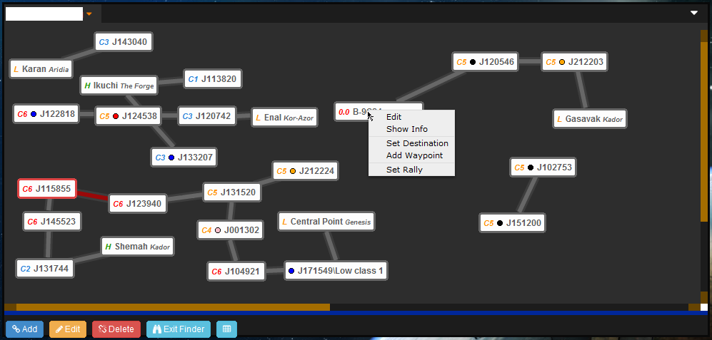
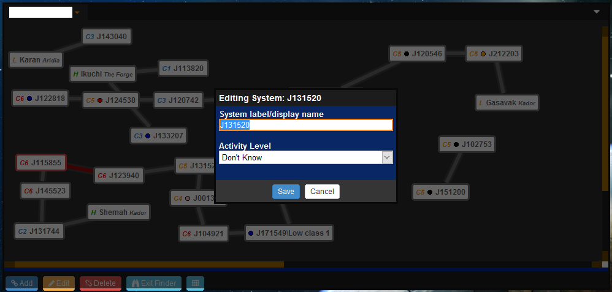

# Chain Maps

The chain map is the main navigation aid. It allows pilots to create a chain map that will visibly show all systems, their "status" based on scouting and where they lead. Custom names allow for the use of custom naming conventions and multiple chain maps can be created.

If your siggy has more than one chain map, select a chain map using the dropdown on the top left corner.

## Map Legend

### Wormhole Connections

  * **Pink Outline:** Wormhole is end of life.
  * **White Outline:** Wormhole is frigate sized.
  * **Light Blue Outline:** Wormhole is frigate sized and end of life.
  * **Grey Fill:** Wormhole has stage 1 mass (not reduced / not critical).
  * **Yellow Fill:** Wormhole has stage 2 mass (reduced).
  * **Red Fill:** Wormhole has stage 3 mass (critical).

### Misc. Connections:

  * **White Dotted Line:** Connected by stargate(s).
  * **Blue Dotted Line:** Connected by jump bridge.
  * **Yellow Dotted Line:** Connected by cyno jump.

### Systems

  * **Grey Border:** Default / unknown system status.
  * **Blue Border:** Friendly system status.
  * **Yellow Border:** Occupied system status.
  * **Green Border:** Empty / clear / safe system status.
  * **Red Border:** Active / hostile system status.

## Mapping Systems

Connections can be mapped in two ways:

  * **Automatic:** Systems will automatically map when you jump between systems. The only limitation is it cannot handle k-space to k-space jumps due to stargates.
  * **Manual:** Systems can be connected manually. There are no restrictions on the systems.

To manually add a new connection:

1. Enter the from and to systems into their respective fields. To use current location, check the respective checkboxes.

2. Select the connection type (Wormhole, Cyno, Stargate, Jump Bridge).

3. If it is a wormhole, add wormhole details if applicable (not required).

4. Hit "Save".

It is possible to disable automatic mapping by clicking the "Disable location broadcasting" button.

## Editing The Map

The map editing function provides the ability to move systems around and organize the chain.

To edit the map:

1. Click the "Edit" button.

2. Click and drag on the systems to move them around.

3. Hit "Save Map Changes" to commit the changes.

## Connections

### Wormhole Options

Wormholes between systems have three options that can be set:

  * **EOL?:** Sets whether the wormhole is EOL or not on the map. EOL wormholes show up as pink outline. Additionally, the time the wormhole is set EOL is recorded and can be seen by hovering over the connection on the map.

  * **Frigate sized?:** Sets whether the wormhole is frigate sized or not on the map. Frigate sized wormholes show up as white outline.

  * **Mass Stage:** Sets the wormhole mass stage, i.e. Healthy, Reduced, and Critical (or whatever your group may call these stages). The color of the wormhole connection changes in response on the map.

These options can be opened by simply clicking on a wormhole connection on the map.

### Deletion

Two options exist to delete a connection:

1. Click on a connection and hit the "Disconnect Connection" button.

2. Click the "Delete" button on the bottom bar which activates mass delete mode.

To use the mass delete function:

1. Click the "Delete" button to activate mass delete mode.

2. Click on multiple connection to select them (they turn blue). Click on them again to deselect.

3. Click drag will allow you to select connections within an area.

4. Click "Confirm Mass Delete" to process the deletion or "Cancel" to stop the process.

## Systems

### System Options

Systems have a right click menu which bring up three extra options.

  * **Edit:** Edit the system name and activity level.
  * **Show Info:** Opens the in-game information window or dotlan out of game.
  * **Set Destination:** Sets your destination to the selected system.
  * **Add Waypoint:** Adds waypoint to the selected system.
  * **Set Rally:** Set rally (indicate a system with purple highlight) to a selected system.

### Editing Systems

Systems come with options to set:

  * **Display Name:** This is the name that will be visible on the chain map and the info section below the map. This can be anything and in any language(unicode supported).
  * **Activity Level:** The current activity level that was seen by scanners/scouts.

These two entries are not retained permanently, but will re-apply if the system is deleted and reappears within a short amount of time.
